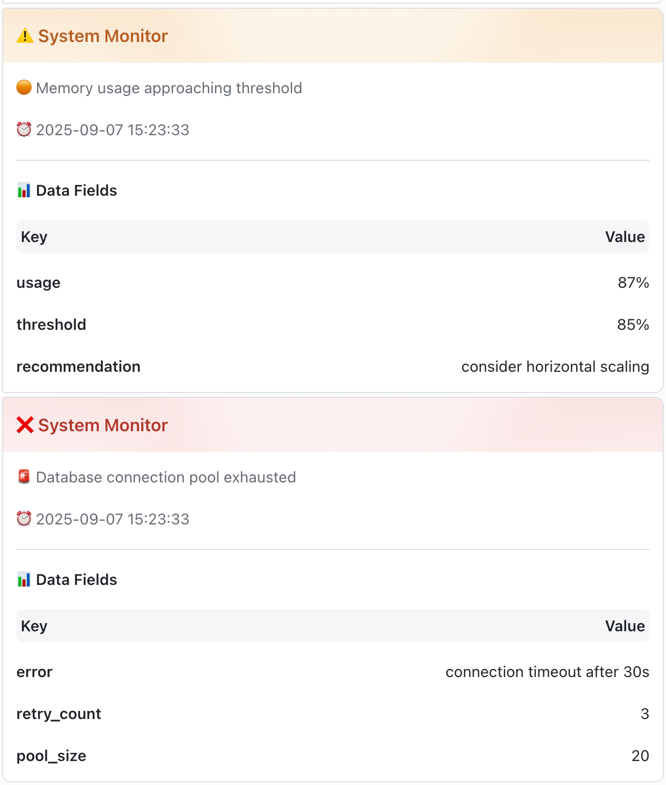
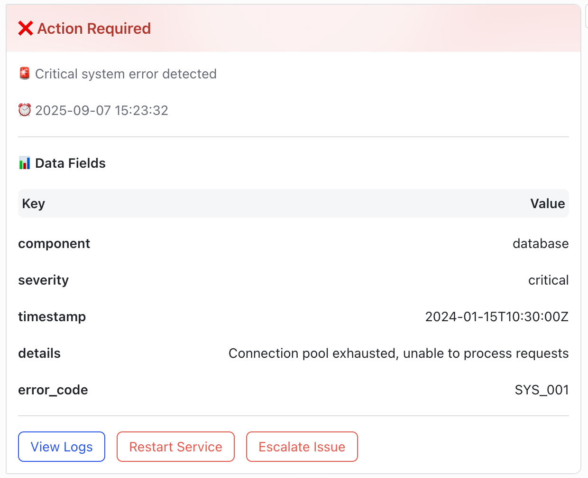

# 🚀 lark-logger

[](https://pkg.go.dev/github.com/KCNyu/lark-logger)
[](https://goreportcard.com/report/github.com/KCNyu/lark-logger)
[](https://opensource.org/licenses/MIT)
[](https://github.com/KCNyu/lark-logger/stargazers)
[](https://go.dev/)
[](https://github.com/KCNyu/lark-logger/pulls)

English | [中文文档](docs/README_zh.md)

🎯 A minimal Go SDK for sending structured logs to Lark (Feishu) via webhook using clean, mobile-friendly cards.

## 📦 Install

```bash
go get github.com/KCNyu/lark-logger
```

## ⚡ Quick start (context required)

```go
import (
  "context"
  larklogger "github.com/KCNyu/lark-logger"
)

func main() {
    ctx := context.Background()
    client := larklogger.NewClient(larklogger.GetWebhookURL())
    logger := larklogger.NewLogger(ctx, client,
        larklogger.WithService("api-gateway"),
        larklogger.WithEnv("production"),
        larklogger.WithTitle("System Monitor"),
        larklogger.WithShowConfig(true),
    )

    logger.Info("Service started", map[string]interface{}{"port": 8080})
    logger.Warnf("Memory usage", "usage", "87%")
}
```

## 🔧 Environment

- `LARK_WEBHOOK_URL`: your bot webhook 🤖
- `LARK_TEST_MODE`: set `true` to skip real sends in tests ✅

## 🎨 Buttons (optional)

```go
logger := larklogger.NewLogger(ctx, client,
  larklogger.WithButtons([]larklogger.Button{
    {Text: "View Logs", URL: "https://logs.example.com", Style: larklogger.ButtonStylePrimary},
    {Text: "Restart", URL: "https://ops.example.com/restart", Style: larklogger.ButtonStyleDanger, Confirm: true},
  }),
)
```

## 🧪 Local testing

- ✅ `make test` sets test mode automatically and skips external sends
- 🔄 Or: `LARK_TEST_MODE=true go test ./src/larklogger/...`

## 📸 Screenshots

- 🖥️ Desktop card:



- 🔘 Desktop buttons:



## 📬 Contact

Questions, feedback or feature requests:
- 🐛 Open an issue: [GitHub Issues](https://github.com/KCNyu/lark-logger/issues)
- 📧 Email: [shengyu.li.evgeny@gmail.com](mailto:shengyu.li.evgeny@gmail.com)