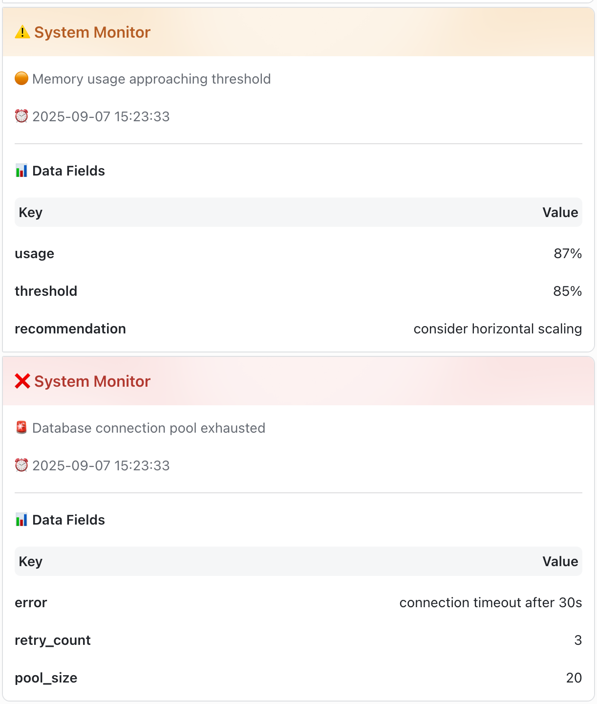
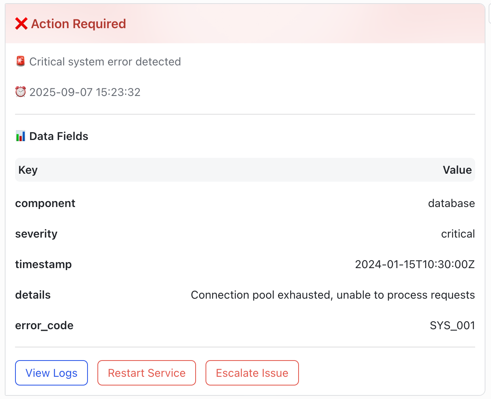

# 🚀 lark-logger

[](https://pkg.go.dev/github.com/KCNyu/lark-logger)
[](https://goreportcard.com/report/github.com/KCNyu/lark-logger)
[](https://opensource.org/licenses/MIT)
[](https://github.com/KCNyu/lark-logger/stargazers)
[](https://go.dev/)
[](https://github.com/KCNyu/lark-logger/pulls)

[English](../README.md) | 中文文档

🎯 一个简洁的 Go SDK，用于通过 Lark（飞书）Webhook 发送结构化日志，卡片样式清晰、移动端友好。

## 📦 安装

```bash
go get github.com/KCNyu/lark-logger
```

## ⚡ 快速开始（必须传入 context）

```go
import (
  "context"
  larklogger "github.com/KCNyu/lark-logger"
)

func main() {
    ctx := context.Background()
    client := larklogger.NewClient(larklogger.GetWebhookURL())
    logger := larklogger.NewLogger(ctx, client,
        larklogger.WithService("api-gateway"),
        larklogger.WithEnv("production"),
        larklogger.WithTitle("系统监控"),
        larklogger.WithShowConfig(true),
    )

    logger.Info("服务启动", map[string]interface{}{"port": 8080})
    logger.Warnf("内存使用率", "usage", "87%")
}
```

## 🔧 环境变量

- `LARK_WEBHOOK_URL`：你的机器人 webhook 🤖
- `LARK_TEST_MODE`：测试模式（`true` 可跳过真实发送）✅

## 🎨 可选操作按钮

```go
logger := larklogger.NewLogger(ctx, client,
  larklogger.WithButtons([]larklogger.Button{
    {Text: "查看日志", URL: "https://logs.example.com", Style: larklogger.ButtonStylePrimary},
    {Text: "重启服务", URL: "https://ops.example.com/restart", Style: larklogger.ButtonStyleDanger, Confirm: true},
  }),
)
```

## 📸 截图

- 🖥️ 桌面卡片展示：



- 🔘 桌面按钮/确认示例：



## 📬 联系方式

如有问题、建议或需求：
- 🐛 提交 Issue：[GitHub Issues](https://github.com/KCNyu/lark-logger/issues)
- 📧 邮箱：[shengyu.li.evgeny@gmail.com](mailto:shengyu.li.evgeny@gmail.com)